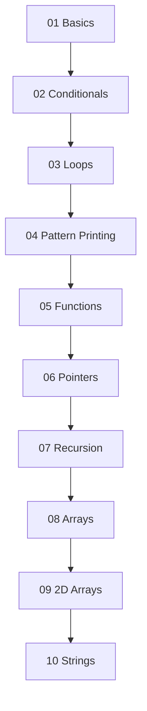

# 🚀 Complete C++ Programming Course

[](https://en.wikipedia.org/wiki/C%2B%2B)
[](LICENSE)
[](CONTRIBUTING.md)
[](https://github.com/JunaidHassan19/c--)

## 📖 About This Course

Welcome to the **Complete C++ Programming Course**! This comprehensive repository contains a structured learning path for mastering C++ programming from basics to advanced concepts. Whether you're a complete beginner or looking to strengthen your C++ skills, this course has something for everyone.

## 🎯 Course Objectives

- 📚 **Learn C++ fundamentals** from scratch
- 🔧 **Practice with real-world examples** and exercises
- 🧠 **Develop problem-solving skills** through pattern printing and algorithms
- 💻 **Build a strong foundation** in programming concepts
- 🏆 **Master advanced topics** like pointers, recursion, and data structures

## 📂 Course Structure

### 📋 Table of Contents

| Chapter | Topic                                          | Files    | Description                                       |
| ------- | ---------------------------------------------- | -------- | ------------------------------------------------- |
| **01**  | [Basics](./01%20Basics/)                       | 18 files | Fundamentals of C++ programming                   |
| **02**  | [Conditionals](./02%20Conditionals/)           | 18 files | Decision making with if-else statements           |
| **03**  | [Loops](./03%20Loops/)                         | 28 files | Iteration with for, while, and do-while loops     |
| **04**  | [Pattern Printing](./04%20Pattern%20Printing/) | 62 files | Creative pattern printing exercises               |
| **05**  | [Functions](./05%20Functions/)                 | 9 files  | Function definition, parameters, and return types |
| **06**  | [Pointers](./06%20Pointers/)                   | 4 files  | Memory management and pointer operations          |
| **07**  | [Recursion](./07%20Recursion/)                 | 8 files  | Recursive algorithms and problem solving          |
| **08**  | [Arrays](./08%20Arrays/)                       | 10 files | Single-dimensional array operations               |
| **09**  | [2D Arrays](./09%202D%20Arrays/)               | 10 files | Multi-dimensional array manipulation              |
| **10**  | [Strings](./10%20Strings/)                     | 13 files | String operations and text processing             |

---

## 🌟 Key Features

### ✨ What Makes This Course Special?

- **📝 Well-commented Code**: Every example includes detailed explanations
- **🎨 Pattern Gallery**: 31 unique pattern printing challenges
- **🔄 Progressive Learning**: Concepts build upon each other systematically
- **💡 Practical Examples**: Real-world applications of each concept
- **🧪 Hands-on Practice**: Multiple exercises for each topic

---

## 🚦 Getting Started

### Prerequisites

- Basic understanding of programming concepts (helpful but not required)
- A C++ compiler (GCC, Visual Studio, Code::Blocks, etc.)
- Text editor or IDE of your choice

### Installation & Setup

1. **Clone the repository**

   ```bash
   git clone https://github.com/JunaidHassan19/c--.git
   cd c--
   ```

2. **Compile and run any C++ file**

   ```bash
   g++ -o program "01 Basics/01.cpp"
   ./program
   ```

3. **Start with Chapter 1** and work your way through each section

---

## 📚 Learning Path

### 🎯 Recommended Study Sequence



### 📖 Chapter Details

#### 🔤 **Chapter 1: Basics**

- Variables and data types
- Input/output operations
- Basic operators
- Program structure

#### 🔀 **Chapter 2: Conditionals**

- if, else if, else statements
- Switch case statements
- Logical operators
- Decision making

#### 🔄 **Chapter 3: Loops**

- For loops
- While loops
- Do-while loops
- Nested loops
- Loop control statements

#### 🎨 **Chapter 4: Pattern Printing**

- Star patterns
- Number patterns
- Character patterns
- Complex geometric patterns

#### ⚙️ **Chapter 5: Functions**

- Function declaration and definition
- Parameters and arguments
- Return types
- Function overloading

#### 📍 **Chapter 6: Pointers**

- Pointer basics
- Pointer arithmetic
- Pointers and arrays
- Dynamic memory allocation

#### 🔁 **Chapter 7: Recursion**

- Recursive functions
- Base cases
- Recursive algorithms
- Problem solving with recursion

#### 📊 **Chapter 8: Arrays**

- Array declaration and initialization
- Array operations
- Searching and sorting
- Array algorithms

#### 🔢 **Chapter 9: 2D Arrays**

- Matrix operations
- 2D array traversal
- Matrix algorithms
- Multi-dimensional thinking

#### 🔤 **Chapter 10: Strings**

- String operations
- String functions
- Text processing
- String algorithms

---

## 🎨 Pattern Gallery Preview

Here are some of the exciting patterns you'll learn to create:

```
⭐ Basic Patterns    🔺 Triangle Patterns    💎 Diamond Patterns
*****               *                        *
*****               **                      ***
*****               ***                    *****
                    ****                   *****
                    *****                   ***
                                             *
```

---

## 🤝 Contributing

We welcome contributions! Here's how you can help:

- 🐛 Report bugs or issues
- 💡 Suggest new examples or improvements
- 📝 Improve documentation
- ✨ Add new practice problems

### How to Contribute

1. Fork the repository
2. Create a feature branch (`git checkout -b feature/AmazingFeature`)
3. Commit your changes (`git commit -m 'Add some AmazingFeature'`)
4. Push to the branch (`git push origin feature/AmazingFeature`)
5. Open a Pull Request

---

## 📈 Progress Tracking

Track your learning progress:

- [ ] **Basics** (18 exercises)
- [ ] **Conditionals** (18 exercises)
- [ ] **Loops** (28 exercises)
- [ ] **Pattern Printing** (31 exercises)
- [ ] **Functions** (9 exercises)
- [ ] **Pointers** (4 exercises)
- [ ] **Recursion** (8 exercises)
- [ ] **Arrays** (10 exercises)
- [ ] **2D Arrays** (10 exercises)
- [ ] **Strings** (13 exercises)

**Total**: 149 practical exercises! 🎉

---

## 📞 Support & Community

- 💬 **Issues**: [GitHub Issues](https://github.com/JunaidHassan19/c--/issues)
- 📧 **Email**: [Contact the author](mailto:thejunni01@gmail.com.com)
- 💼 **LinkedIn**: [Connect with us](https://www.linkedin.com/in/junaidhassan19/)

---

## 📜 License

This project is licensed under the MIT License - see the [LICENSE](LICENSE) file for details.

---

## 🙏 Acknowledgments

- Thanks to all contributors who have helped improve this course
- Special thanks to the C++ community for continuous inspiration
- Inspired by best practices in programming education

---

## 📊 Repository Stats


---

<div align="center">

### 🌟 Happy Coding! 🌟

**Start your C++ journey today and build amazing things!**

[⬆️ Back to Top](#-complete-c-programming-course)

</div>

---

> **Note**: This course is designed for educational purposes. Feel free to use these examples in your own projects and learning journey!
